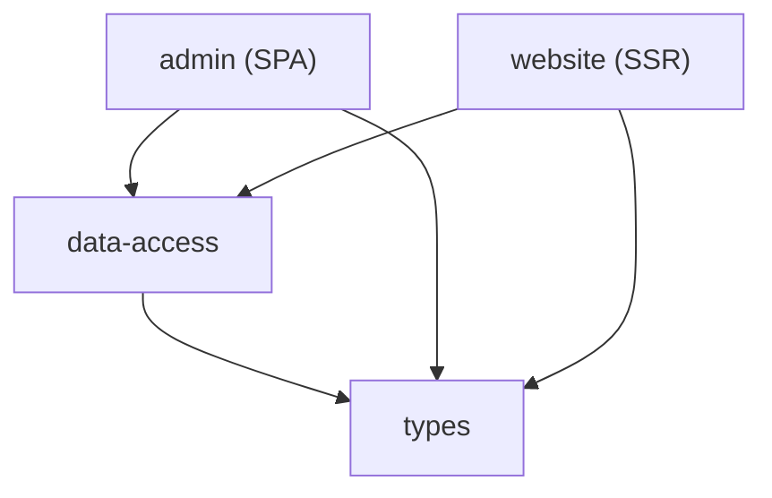

# Ecommerce Full-Stack

Monorepo de e-commerce construido con **Angular 21**, **Nx 22**, **Tailwind CSS 4** y desplegado en **Cloudflare**. Incluye una tienda pública con SSR y un panel de administración como SPA.

## Arquitectura del monorepo



| Proyecto | Tipo | Descripción |
|----------|------|-------------|
| `admin` | App | Panel de administración — SPA con Angular Material |
| `website` | App | Tienda pública — SSR con hidratación incremental y zoneless |
| `data-access` | Lib | Servicios HTTP compartidos (`ProductService`, `CategoryService`) |
| `types` | Lib | Interfaces TypeScript del dominio (`Product`, `Category`, `User`) |

## Stack tecnológico

- **Framework**: Angular 21 (signals, zoneless, incremental hydration)
- **Monorepo**: Nx 22
- **Build**: Vite 8, `@angular/build`
- **Testing**: Vitest 4 con `@analogjs/vitest-angular`
- **Estilos**: Tailwind CSS 4, Angular Material (solo admin)
- **SSR**: `@angular/ssr` con `AngularAppEngine` (plataforma neutral)
- **Lenguaje**: TypeScript 5.9
- **Linting**: ESLint 9, Prettier
- **Deploy**: Cloudflare Pages / Workers

## Prerequisitos

- Node.js >= 20
- pnpm

## Inicio rápido

```bash
# Instalar dependencias
pnpm install

# Servir la tienda pública (con SSR)
pnpm nx serve website

# Servir el panel de administración
pnpm nx serve admin
```

## Comandos de desarrollo

### Por proyecto

```bash
# Website (tienda pública)
pnpm nx serve website        # Dev server con SSR
pnpm nx build website        # Build de producción
pnpm nx test website         # Tests unitarios
pnpm nx lint website         # Linting

# Admin (panel de administración)
pnpm nx serve admin          # Dev server
pnpm nx build admin          # Build de producción
pnpm nx test admin           # Tests unitarios
pnpm nx lint admin           # Linting

# Libs
pnpm nx test data-access     # Tests de data-access
pnpm nx lint data-access     # Linting de data-access
pnpm nx build types          # Build de types
```

### Globales

```bash
pnpm nx run-many -t build              # Build de todos los proyectos
pnpm nx run-many -t test               # Tests de todos los proyectos
pnpm nx run-many -t lint               # Lint de todos los proyectos
pnpm nx affected -t build              # Build solo de proyectos afectados
pnpm nx graph                          # Visualizar grafo de dependencias
```

## Estructura del workspace

```
ecommerce-full-stack/
├── apps/
│   ├── admin/                  # SPA — Angular Material + Tailwind
│   │   └── src/app/
│   │       ├── guards/         # Auth guard
│   │       ├── interceptors/   # Token interceptor (JWT)
│   │       ├── modules/        # Lazy-loaded: auth, admin, dashboard,
│   │       │                   #   categories, products, users
│   │       └── services/       # Auth, token, UI, user services
│   └── website/                # SSR — Zoneless + Hydration
│       └── src/app/
│           └── domains/
│               ├── info/       # About, locations, 404
│               ├── products/   # Lista, detalle de productos
│               └── shared/     # Layout, header, search, cart,
│                               #   pipes, directives
├── libs/
│   ├── data-access/            # Servicios HTTP: ProductService,
│   │                           #   CategoryService, API_URL token
│   └── types/                  # Interfaces: Product, Category,
│                               #   User, LoginRta
├── nx.json                     # Configuración de Nx
├── package.json                # Dependencias del workspace
└── tsconfig.base.json          # Path aliases (@store/*)
```

## Path aliases

| Alias | Ruta |
|-------|------|
| `@store/data-access` | `libs/data-access/src/index.ts` |
| `@store/types` | `libs/types/src/index.ts` |
| `@store/admin/*` | `apps/admin/src/*` |
| `@store/website/*` | `apps/website/src/*` |

## Despliegue (Cloudflare)

```bash
npx wrangler d1 create nicobytes_store
npx wrangler pages project create nicobytes-store-admin
npx wrangler pages project create nicobytes-store-website-spa
```
